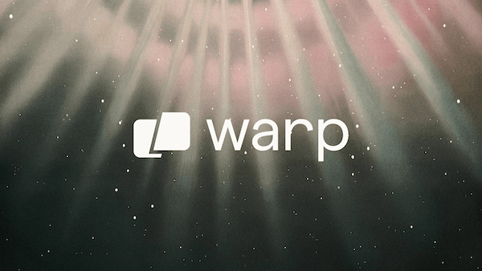

---
<div align="center">
  <sup>特别感谢：</sup>
  <br>
  <a href="https://www.warp.dev/drawdb/" target="_blank">
    
    <br>
    <b>新一代 AI 驱动的智能终端，适用于所有平台</b>
  </a>
</div>
<br/>
<br/>

<div align="center">
    
    <h1>drawDB</h1>
</div>

<h3 align="center">免费、简单、直观的数据库模式编辑器和 SQL 生成器。</h3>

<div align="center" style="margin-bottom:12px;">
    <a href="https://drawdb.app/" style="display: flex; align-items: center;">
        
    </a>
    <a href="https://discord.gg/BrjZgNrmR6" style="display: flex; align-items: center;">
        
    </a>
    <a href="https://x.com/drawDB_" style="display: flex; align-items: center;">
        
    </a>
</div>

<h3 align="center"></h3>

DrawDB 是一个强大且用户友好的数据库实体关系（DBER）编辑器，直接在浏览器中运行。只需几次点击即可构建图表，导出 SQL 脚本，自定义编辑器等，无需创建账户。查看完整功能列表请访问[这里](https://drawdb.app/)。

## 快速开始

### 本地开发

```bash
git clone https://github.com/drawdb-io/drawdb
cd drawdb
pnpm install
pnpm run dev
```

### 构建

```bash
git clone https://github.com/drawdb-io/drawdb
cd drawdb
pnpm install
pnpm run build
```

### Docker 构建

```bash
docker build -t drawdb .
docker run -p 3000:80 drawdb
```

如果你想使用分享功能，请设置[服务器](https://github.com/drawdb-io/drawdb-server)并根据 `.env.sample` 配置环境变量。除非你想分享文件，否则这不是必需的。
