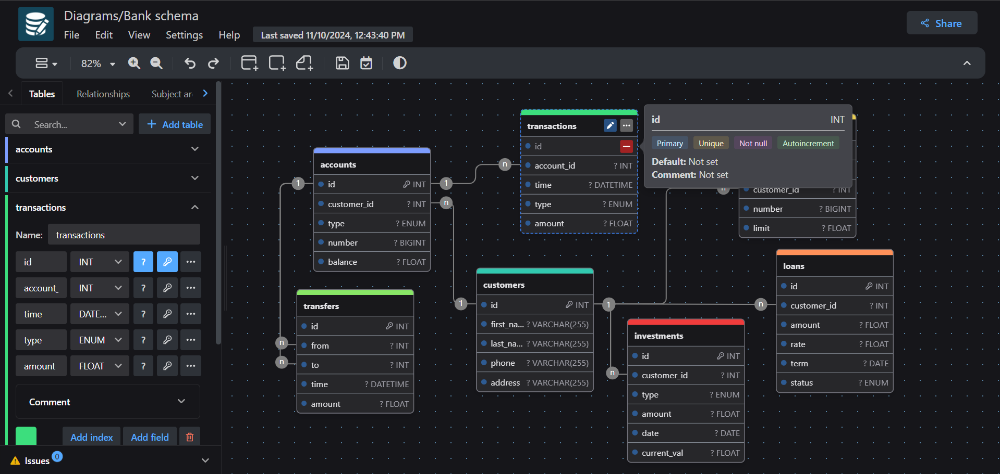

<div align="center">
  <sup>Special thanks to:</sup>
  <br>
  <a href="https://www.warp.dev/drawdb/" target="_blank">
    
    <br>
    <b>Next-gen AI-powered intelligent terminal for all platforms</b>
  </a>
</div>

<br/>
<br/>

<div align="center">
    
    <h1>drawDB</h1>
</div>

<h3 align="center">Free, simple, and intuitive database schema editor and SQL generator.</h3>

<div align="center" style="margin-bottom:12px;">
    <a href="https://drawdb.app/" style="display: flex; align-items: center;">
        
    </a>
    <a href="https://discord.gg/BrjZgNrmR6" style="display: flex; align-items: center;">
        
    </a>
    <a href="https://x.com/drawDB_" style="display: flex; align-items: center;">
        
    </a>
</div>

<h3 align="center"></h3>

DrawDB is a robust and user-friendly database entity relationship (DBER) editor right in your browser. Build diagrams with a few clicks, export sql scripts, customize your editor, and more without creating an account. See the full set of features [here](https://drawdb.app/).

## Getting Started

### Local Development

```bash
git clone https://github.com/drawdb-io/drawdb
cd drawdb
npm install
npm run dev
```

### Build

```bash
git clone https://github.com/drawdb-io/drawdb
cd drawdb
npm install
npm run build
```

### Docker Build

```bash
docker build -t drawdb .
docker run -p 3000:80 drawdb
```

If you wish to work with sharing, set up [server](https://github.com/drawdb-io/drawdb-server) and environment variables according to `.env.sample`. This is not required unless you want to share files.
