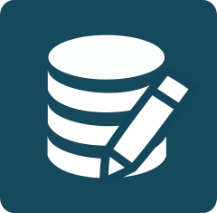
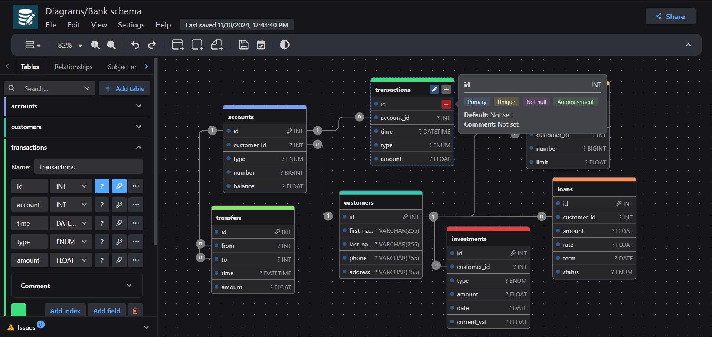

<div align="center">

<br/>

<a href="https://www.warp.dev/drawdb/" target="_blank">
  <picture>
    
  </picture>
  <br/>
  <sub><b>✦ Special thanks to Warp — the next-gen AI-powered terminal for all platforms ✦</b></sub>
</a>

<br/>
<br/>
<br/>



# drawDB

### Free, simple, and intuitive database schema editor & SQL generator

<br/>

[](https://drawdb.app/)
[](https://discord.gg/BrjZgNrmR6)
[](https://x.com/drawDB_)

<br/>



</div>

<br/>

---

**drawDB** is a robust, browser-native entity relationship diagram (ERD) editor — no account required. Design database schemas visually, export and import SQL scripts, generate migrations, and customize your workspace, all with just a few clicks.

→ Explore the full feature set at **[drawdb.app](https://drawdb.app/)**

---

## 🚀 Getting Started

### Local Development

```bash
git clone https://github.com/drawdb-io/drawdb
cd drawdb
npm install
npm run dev
```

### Production Build

```bash
git clone https://github.com/drawdb-io/drawdb
cd drawdb
npm install
npm run build
```

### Docker

```bash
docker build -t drawdb .
docker run -p 3000:80 drawdb
```

> **Optional:** To enable diagram sharing, set up the [drawdb server](https://github.com/drawdb-io/drawdb-server) and configure environment variables as described in `.env.sample`.

---

## 🤝 Contributing

Contributions are welcome! Please read [**CONTRIBUTING.md**](CONTRIBUTING.md) before submitting a pull request.

## 💬 Support & Community

Have a question or want to chat with other users?

→ Join us on [**Discord**](https://discord.gg/BrjZgNrmR6)
